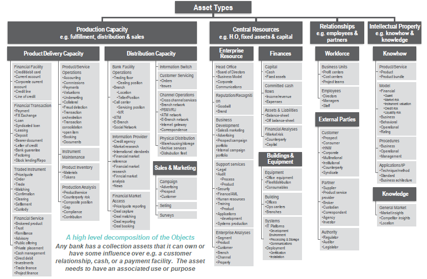

<p align="center">
  
</p>

# Halo Bian Service Domain - Flask BIAN halo_current_account Service

The **Halo halo_current_account** is a microservice seed implementation of the the Service Domain.

### Flask components

- RESTful microservice (via Flask-RESTful)
- Distributed central service configuration (via Spring Config Server)
- Dynamic service registration and resolution (via Eureka Registry Server)
- Service-to-service load balancing (via Ribbon)
- Service outage quick failover, state tracking and reporting (via Circuit Breaker)

### Flask BIAN library components (dark yellow)

- BIAN functional pattern specific service classes (Functional Pattern)
- BIAN asset type base classes (Asset Type)
- BIAN generic artifact classes (Generic Artifact)
- BIAN behavior qualifier classes (Behavior Qualifier)
- BIAN control record classes (Control Record)
- BIAN service domain specific control record classes
- Common DTO (Data Transfer Object) methodology classes for data mapping between front facing API and internal control record
- Common DTO (Data Transfer Object) methodology classes for data mapping between internal control record and native backend payloads
- Service Operation handling with default handlers for functional pattern services per BIAN specification.
- RESTful method to BIAN service operation mapper and handling
- Service exception handling
- Service status and BIAN information endpoints

### Developer provided components (light yellow)

- Service domain service operation handlers
- DTO mapping rules for front facing consumer API
- DTO mapping rules for backend native API's


## Usage

The repository contains the following module:

- halo_current_account - the core Spring BIAN Service Domain

### Installing the library

After cloning the repository to a local directory, install the library by executing the following from within the BIAN library folder

```
mvn clean install -DskipITs
```

This will compile, test and copy the Spring BIAN library to your local maven repository.

### Using the library

1. Create a basic Spring Boot RESTful application.  [Spring Initializr](http://start.spring.io/) is a helpful tool for this.  Here are some common modules to add to your project:
  * Web - web application framework
  * Config Client - spring config server client
  * Eureka Discovery - service registration and discovery
  * Hystrix - circuit breaker
  * Sleuth - distributed tracing
  * Actuator - application monitoring and management

   Optional modules:

  * JPA - persistence API
  * Persistence engine (MySQL, JDBC, etc)

   External dependencies:

  * Swagger2 - API documentation
  * Jackson - data mapping
  * ModelMapper - DTO data mapping
2. Add the bian-core library to your dependencies (io.pivotal.spring.bian-core)

   **pom.xml**:
```
<dependency>
        <groupId>io.pivotal.spring</groupId>
        <artifactId>bian-core</artifactId>
        <version>0.0.1-SNAPSHOT</version>
</dependency>
```
3. Optionally add cloud services support to you application for service registry and circuit breaker:

   **Application.java**:
```
@SpringBootApplication
@EnableDiscoveryClient
@EnableCircuitBreaker
```
4. Identify the BIAN functional pattern of the service domain, and create a RESTful service that subclasses the appropriate BIAN functional service (io.pivotal.spring.bian.service.\*).  By subclassing the functional service, your service automatically inherits a host of common functionality like RESTful endpoints, messaging, error handling, in addition to BIAN functional pattern specific service operation handling.

   **MyLocationServiceEndpoint.java**:
```
@RestController
@RequestMapping("/v1/location")
public class LocationServiceEndpoint extends RegisterServiceController {
  ...
}

```
5. Generate service operation stub methods.  Your IDE should flag that certain virtual methods within the new service domain subclass are required to be defined.  Allow it to automatically create stubs for these methods.  The methods requiring definition are dependent on the functional pattern being subclassed.
```
...
@Override
public BianApiResponse doActivate(Object request) {
  // TODO Auto-generated method stub
  return null;
}

@Override
public BianApiResponse doConfigure(Object request) {
  // TODO Auto-generated method stub
  return null;
}
...

```
6. Identify the payload structure of the service domain, both for internal field usage and external data standard mappings.  Optionally create a control record for your functional pattern / asset type combination.

   **LocationDirectory.java**:
```
public class LocationDirectory extends ControlRecord<Location, Directory, Property> {
	public LocationDirectory() throws InstantiationException, IllegalAccessException {
		super(Location.class, Directory.class, Property.class);
	}

	public LocationDirectory(Location location, Directory directory, Property property) {
		super(location, directory, property);
	}
}
```
7. Create data mappings for API input to control record, control record to API output, and control record to service back-end.
```
public LocationServiceEndpoint() throws InstantiationException, IllegalAccessException {
  super(new LocationDirectory());
  modelMapper.addMappings(new PropertyMap<FreeGeoIpLocation, IfxLocation>() {
    @Override
    protected void configure() {
      map().setIpAddress(source.getIp());
      map().getCustId().getPersonalIdent().getContactInfo().getPostAddr().setCity(source.getCity());
      map().getCustId().getPersonalIdent().getContactInfo().getPostAddr().setCountry(source.getCountryCode());
      map().getCustId().getPersonalIdent().getContactInfo().getPostAddr().setStateProv(source.getRegionCode());
      map().getCustId().getPersonalIdent().getContactInfo().getPostAddr().setPostalCode(source.getZipCode());
    }
  });
}
...
public BianApiResponse doRetrieve(Object request) {
...
  modelMapper.map(backendData, response);
...
}
```
8. Implement the stubbed-out service operation calls by making any necessary back-end native calls.
```
@Override
public BianApiResponse doRetrieve(Object request) {
  BianApiRequest requestDto = (BianApiRequest)request;
  LocationApiResponse response = new LocationApiResponse();
  response.setExecutionTimestamp(System.currentTimeMillis());
  response.setRequest(requestDto);
  FreeGeoIpLocation geoIpLocation = geoIpService.getGeoIpLocation(requestDto.getReferenceId());
  IfxLocation ifxLocation = new IfxLocation();
  modelMapper.map(geoIpLocation, ifxLocation);
  response.setLocation(ifxLocation);
  return response;
}
```


The **Halo Bian** library is based on the [**Halo**](https://github.com/yoramk2/halo_flask) library which is a python based library utilizing [**Serverless**](https://logz.io/blog/serverless-vs-containers/) technology and [**microservices architecture**](http://blog.binaris.com/your-guide-to-migrating-existing-microservices-to-serverless/) 

BIAN (Banking Industry Architecture Network) is a membership group committed to developing open standards around banking and financial services.  A key deliverable of this group is the BIAN Service Landscape model which defines a comprehensive services architecture for financial transactions and facilities.  This library is an implementation of the BIAN model leveraging the Flask framework and allows a developer to **rapidly create BIAN-compliant services** while hiding much of the underlying BIAN model details.  See www.bian.org for more information on BIAN.

This library leverages not only the Flask framework, but a number of the Flask Cloud Services components as well to facilitate building robust and resilient cloud-native BIAN microservices. 
deploy your Service Domain to your local environment or use [**Serverless Framework**](https://serverless.com/) and [**zappa**](https://github.com/Miserlou/Zappa) to deploy your Service Domain to AWS.

## BIAN Basics

Before diving into the library architecture, it helps to understand two key concepts within BIAN, service domains and control records.

### Service Domain

The BIAN Service Landscape defines discrete areas of responsibility known as service domains.  A **Service Domain** is a combination of a **Functional Pattern** and an **Asset Type**.  For instance, using the functional pattern 'Registry' with the asset type 'Product' would yield a 'Product Registry' service domain, which could be used to manage a product catalog.  If we instead changed the asset type to 'Device', we would have a 'Device Registry' service domain that could be used to authorize services on a mobile device.  

### Control Record

The **Control Record** is used to track the state of a service domain, and like the service domain is derived from the functional pattern and asset type.  However, in a control record, the functional pattern is represented by the **Generic Artifact Type**.  There is a one-to-one correlation between functional patterns and generic artifact types.  The control record goes one step further in delineating between specific service domain operations by introducing an additional parameter called the **Behavior Qualifier**, which, like generic artifact types, have a one-to-one correlation with functional patterns.

### In Addition

-  The commercial behaviors that are called Functional Patterns. Functional Patterns, Generic Artifacts and Behavior Qualifier Types are mapped and correlated:     
<p/>
[**Image From Bian Manual**](https://bian.org)

-  A Service Domain applies one of the 18 functional patterns to instances of one type of asset:
<p/>
[**Image From Bian Manual**](https://bian.org)

-  The standard set of ‘action terms’ that characterize the range of service operation calls : 
<p/>
[**Image From Bian Manual**](https://bian.org)

-  The Default Action Term By Functional Pattern matrix:

<p/>
[**Image From Bian Manual**](https://bian.org)


### BIAN Summary

So to summarize the above:

**Functional Pattern** ==> **Generic Artifact Type** ==> **Behavior Qualifier**

**Functional Pattern** + **Asset Type** = **Service Domain**

**Generic Artifact Type** + **Asset Type** + (optional)**Behavior Qualifier** = **Control Record**

**Functional Pattern** is correlated with a set of **Action Term** = **Service Domain Operations**

## Architecture

The Flask BIAN library implements a BIAN service domain wrapper that acts as an API and data translator while hiding much of the BIAN model complexity from the developer.


<p/>Halo Bian provides the following features:

-  Bian version 7 - API release competability
-  OAS ver. 2 support
-  BianRequest object provides bian parameters support
-  ServiceProperties object provides service status 
-  AssetType, GenericArtifact, BehaviorQualifier support per service domain
-  BianServiceInfo object privides Bian details per service
-  Support for all Bian Service Operations
-  Support for all FunctionalPatterns

<p/>Halo provides the following features:

-  Flask development for AWS Lambda & Dynamodb
-  [correlation id across microservices](https://theburningmonk.com/2017/09/capture-and-forward-correlation-ids-through-different-lambda-event-sources/)
-  [structured json based logging](https://theburningmonk.com/2018/01/you-need-to-use-structured-logging-with-aws-lambda/)
-  [sample debug log in production](https://theburningmonk.com/2018/04/you-need-to-sample-debug-logs-in-production/)
-  [support for microservice transactions with the saga pattern](https://read.acloud.guru/how-the-saga-pattern-manages-failures-with-aws-lambda-and-step-functions-bc8f7129f900)
-  [using SSM Parameter Store over Lambda env variables](https://hackernoon.com/you-should-use-ssm-parameter-store-over-lambda-env-variables-5197fc6ea45b)
-  [Serverless Error Handling & trace id for end users](https://aws.amazon.com/blogs/compute/error-handling-patterns-in-amazon-api-gateway-and-aws-lambda/)
-  [Lambda timeout](https://blog.epsagon.com/best-practices-for-aws-lambda-timeouts) management for [slow HTTP responses](https://theburningmonk.com/2018/01/aws-lambda-use-the-invocation-context-to-better-handle-slow-http-responses/)
-  [ootb support for Idempotent service invocations (md5)](https://cloudonaut.io/your-lambda-function-might-execute-twice-deal-with-it/)

If you are building a Python web app running on AWS Lambda (Flask), use this library to manage api transactions:

```
            sagax = load_saga("test", jsonx, schema)
            payloads = {"BookHotel": {"abc": "def"}, "BookFlight": {"abc": "def"}, "BookRental": {"abc": "def"},
                        "CancelHotel": {"abc": "def"}, "CancelFlight": {"abc": "def"}, "CancelRental": {"abc": "def"}}
            apis = {"BookHotel": self.create_api1, "BookFlight": self.create_api2, "BookRental": self.create_api3,
                    "CancelHotel": self.create_api4, "CancelFlight": self.create_api5, "CancelRental": self.create_api6}
            try:
                self.context = Util.get_lambda_context(request)
                ret = sagax.execute(self.req_context, payloads, apis)
                return {"saga": "good"}, 200
            except SagaRollBack as e:
                return {"saga": "bad"}, 500
```


## License

This project is licensed under the MIT License

## Acknowledgments

* Pivotal-Field-Engineering - https://github.com/Pivotal-Field-Engineering/spring-bian

* Bian api - https://github.com/bianapis

* Bian - http://bian.org


